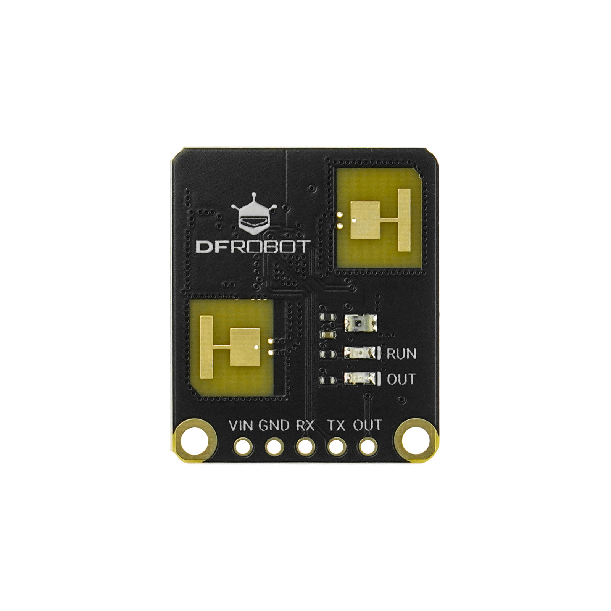

# DFRobot_C4002
- [中文版](./README_CN.md)

This is a 24Ghz millimeter-wave distance radar sensor with a side-mounted motion detection range of 11m and a static detection range of 11m (top-mounted motion detection range with a diameter of 11m and a static detection range of 11m). It also features proximity and distance detection functions, regional zoning detection functions, environmental noise collection functions, and an on-board light detection sensor. This sensor is suitable for smart home application scenarios.




## Product Link（www.dfrobot.com）

    SKU：SEN0691

## Table of Contents

* [Summary](#Summary)
* [Installation](#Installation)
* [Methods](#Methods)
* [Compatibility](#Compatibility)
* [History](#History)
* [Credits](#Credits)

## Summary

* Supports a detection range of 0-11m
* Supports 5V main controller
* Supports serial communication
* Supports OUT pin output for detection results
* Supports OUT pin output mode setting
* Supports environmental noise collection
* Supports light intensity detection
* Supports distance threshold enable and threshold value setting
* Supports reporting cycle setting
* Supports environmental light threshold setting
* Supports 80cm and 20cm resolution setting
* Supports obtaining target status and related data

## Installation
Download the library file before use, paste it into the custom directory for Raspberry Pi, then open the examples folder and run the demo in the folder.

## Methods

```python
  def begin(self,outpin = 255):
    '''!
      @brief begin
      param outpin: output pin, default is 255, which means no output pin is used.
      @return True or False
    '''

  def set_run_led_state(self, run_led):
    '''!
      @brief set run led state
      @param switching LED_OFF:off LED_ON:on LED_KEEP:keep
      @return True or False
    '''

  def set_out_led_state(self, out_led):
    '''!
      @brief set out led state
      @param outled LED_OFF:off LED_ON:on LED_KEEP:keep
      @return True or False
    '''

  def set_out_pin_mode(self, out_mode):
    '''!
      @brief set output pin mode
      @param out_mode
      @n  OUT_PIN_MODE1:Only when motion is detected will a high level be output.
      @n  OUT_PIN_MODE2:A high level is output only when its presence is detected.
      @n  OUT_PIN_MODE3:A high level only appears when motion or presence is detected.
      @return True or False
    '''

  def start_env_calibration(self,delay_time,cont_time):
    '''!
      @brief start environment calibration
      @param delay_time: delay time.range:0-65535s
      @param cont_time : continuous time.range:15-65535s
    '''

  def set_detect_range(self, closet_distance, farthest_distance):
    '''!
      @brief set detect range,unit:cm,range:0-1100cm
      @param closet_distance   : recent distance
      @param farthest_distance : farthest distance
      @return True or False
    '''

  def configure_gate(self, gate_type, gate_data):
    '''!
      @brief configure distance gate
      @param gate_type：distance gate type
      @n              MOTION_DISTANCE_GATE:motion distance gate
      @n              PRESENCE_DISTANCE_GATE:presence distance gate
      @param gate_data：The distance gate status data is an array. The length of
      @n                the array depends on the resolution mode. In the 80cm
      @n                mode, 15 gates can be set, and in the 20cm mode, 25 gates
      @n                can be set. Each gate corresponds to the index of
      @n                the array, starting from 0.
      @return True or False
    '''

  def factory_reset(self):
    '''!
      @brief factory reset,Restart takes effect
      @return True or False
    '''

  def set_resolution_mode(self, resolution_mode):
    '''!
      @brief set resolution mode
      @param resolution_mode: resolution mode
      @n              RESOLUTION_80CM:80cm
      @n              RESOLUTION_20CM:20cm
      @return True or False
    '''

  def set_report_period(self, period):
    '''!
      @brief set report period
      @param period report period,unit:0.1s
      @return True or False
    '''

  def set_light_thresh(self, threshold):
    '''!
      @brief set light threshold
      @param threshold light threshold, range: 0-50, unit: lux
      @n     Note: When the valve group is set to 0, the target detection function will be triggered regardless of the light intensity.
      @n     When the threshold is not 0, the target inspection function will only be activated when the light intensity is lower than the threshold; otherwise, it will not be activated
      @return True or False
    '''

  def set_gate_thresh(self,gate_type , thresh):
    '''!
      @brief set gate threshold
      @param gate_type: gate type
      @n              MOTION_DISTANCE_GATE  :motion distance gate
      @n              PRESENCE_DISTANCE_GATE:presence distance gate
      @param thresh: Threshold, this is an array. The length of the array depends
      @n                on the resolution mode. In the 80cm mode, 15 gates can be set,
      @n                and in the 20cm mode, 25 gates can be set
      @return True or False
    '''

  def set_baudrate(self, baudrate):
    '''!
      @brief set baudrate
      @param baudrate baudrate
      @n     Note: It takes effect after a successful restart
      @n     The baud rate should not be too high; otherwise, it will lead to data loss
      @return True or False
    '''

  def get_note_info(self):
    '''!
      @brief get note data info
    '''

  def get_target_state(self):
    '''!
      @brief get target state
      @return detect result
      @n    NO_TARGET:no target
      @n    PRESENCE:presence
      @n    MOTION:motion
    '''

  def get_presence_gate_index(self):
    '''!
      @brief get presence gate index
      @n     Note: When the resolution mode is 80cm, 0 to 15 bits may be set to 1 to represent the presence of the target.
      @n     When the resolution mode is 20cm, 0 to 25 bits may be set to 1 to represent the presence of the target.
      @return The index of the detected target, range: 0-0xFFFFFFFF.
    '''

  def get_presence_target_info(self):
    '''!
      @brief get presence target info
      @return PresenceTarget object
      @n          distance:distance,unit:cm
      @n          energy  :energy,range:0-100
    '''

  def get_motion_target_info(self):
    '''!
      @brief get motion target info
      @return MotionTarget object
      @n          distance  :distance,unit:m
      @n          speed     :speed,unit:m/s
      @n          energy    :energy,range:0-100
      @n          direction :direction,range:
      @n              AWAY        :away
      @n              NODIRECTION :nondirectional
      @n              APPROACHING :near
    '''

  def get_out_target_state(self):
    '''!
      @brief get out target state
      @return out target state
      @n  NO_TARGET             :no target
      @n  MOTION                :motion
      @n  PRESENCE              :presence
      @n  MOTION_OR_NO_TARGET   :motion or no target
      @n  PRESENCE_OR_NO_TARGET :presence or no target
      @n  MOTION_OR_PRESENCE    :motion or presence
      @n  PIN_ERROR             :pin error
    '''

  def set_lock_time(self, lock_time):
    '''!
    @brief Set the lock time. When changing from occupied to unoccupied, the detection function
    @n   is locked for 1 second (default, adjustable). During the lock time, the sensor does not
    @n   detect targets. Detection is allowed again after the lock time expires.
    @param lock_time : The lock time, unit: s range:0.2-10s accuracy:0.1s
    @return True or False
    '''

  def set_target_disappear_delay(self, disappear_time):
    '''!
    @brief Set the delay time for the target to disappear after it is no longer detected
    @param disappear_time : The delay time, unit: s (0-65535s)
    @return True or False
    '''

  def set_sensitivity(self, gate_type, sensitivity):
    '''!
    @brief Set the sensitivity of the detection
    @param gate_type : gate type
    @n  MOTION_DISTANCE_GATE  :motion distance gate
    @n  PRESENCE_DISTANCE_GATE:presence distance gate
    @param sensitivity
    @n  LOW_THRESH_GROUP     :low thresh group
    @n  MID_THRESH_GROUP  :middle thresh group
    @n  HIGH_THRESH_GROUP    :high thresh group
    @n  CUSTOM_THRESH_GROUP  :custom thresh group
    @return True or False
    '''

  def get_sensitivity(self, gate_type):
    '''!
    @brief get sensitivity
    @param gate_type gate type
    @n  MOTION_DISTANCE_GATE  :motion distance gate
    @n  PRESENCE_DISTANCE_GATE:presence distance gate
    @return sensitivity
    '''

  def get_light_thresh(self):
    '''!
    @brief get light threshold
    @return light threshold,unit:lux
    '''

  def get_detect_range(self):
    '''!
    @brief get detect range
    @return DetectRange
    @n          closest :closest detect range, range:0-1100,unit:cm
    @n          farthest:farthest detect range, range:0-1100,unit:cm
    '''

  def get_target_disappear_delay(self):
    '''!
    @brief get target disappear delay
    @return target disappear delay,unit:s
    '''

  def get_all_config_params(self):
    '''!
    @brief get all config params
    @return ConfigParams object
    @n          cur_light_threshold:light threshold,unit:lux
    @n          cur_detect_range:detect range,unit:m
    @n          cur_target_disappe_delay_time:target disappear delay time,unit:s
    @n          cur_motion_sensitivity:motion sensitivity,range:0-100
    @n          cur_presence_sensitivity:presence sensitivity,range:0-100
    @n          cur_out_mode:out mode
    @n          cur_resolution_mode:resolution mode
    @n          cur_led_state:led state
    '''

  def get_presence_count_down(self):
    '''!
    @brief get the remaining time after target disappears, state changes from presence to no target
    @return the remaining time, unit:s
    '''

  def get_distance_gate_thresh(self,gate_type):
    '''!
    @brief get distance gate threshold
    @return distance gate threshold
    '''
```

## Compatibility

* RaspberryPi Version

| Board        | Work Well | Work Wrong | Untested | Remarks |
| ------------ | :-------: | :--------: | :------: | ------- |
| RaspberryPi2 |           |            |    √     |         |
| RaspberryPi3 |     √     |            |          |         |
| RaspberryPi4 |           |            |    √     |         |

* Python Version

| Python  | Work Well | Work Wrong | Untested | Remarks |
| ------- | :-------: | :--------: | :------: | ------- |
| Python2 |     √     |            |          |         |
| Python3 |           |            |    √     |         |


## History

- 2025/11/04 - V1.0.0 version

## Credits

Written by JiaLi(zhixin.liu@dfrobot.com), 2025. (Welcome to our [website](https://www.dfrobot.com/))
